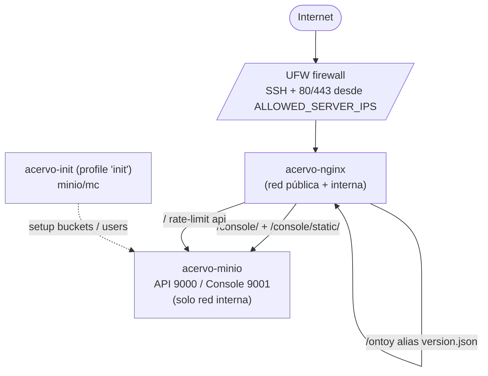
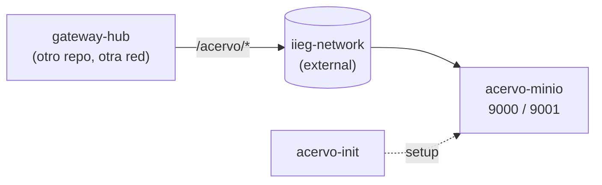
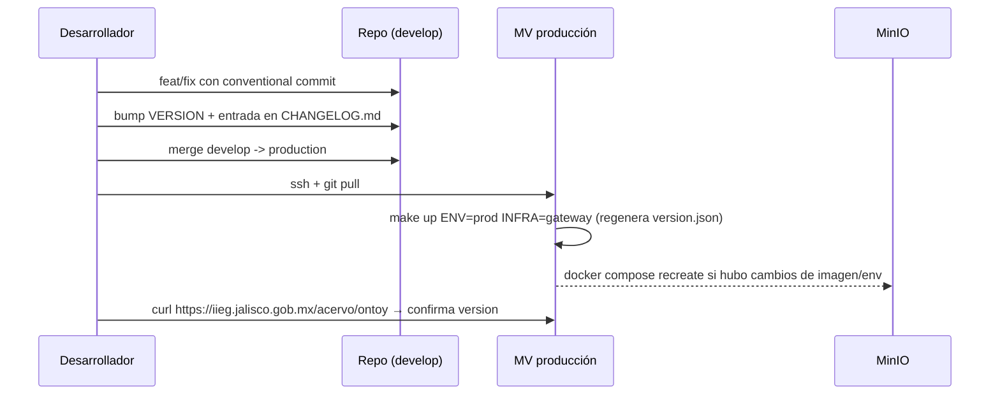

# Contexto del Repositorio Acervo

Documento de referencia completo del servicio. Está pensado para que cualquier persona (o LLM) que entre al repo entienda la intención del diseño, los puntos donde se han pisado callos y las invariantes que hay que respetar al modificar.

---

## 1. Propósito y rol en el ecosistema

**Acervo** es el servicio de almacenamiento de objetos del IIEG, montado sobre [MinIO](https://min.io) (compatible con la API S3 de AWS). Es la capa de "blobs" para todos los frontends y backends del ecosistema institucional:

| Sistema | Bucket | Tipo | Lo que guarda |
|--------|--------|------|---------------|
| portal | `portal` | público (anonymous GetObject) | assets que sirve el portal público |
| mapalab | `mapalab` | público | datasets y exports geográficos |
| mariachi | `mariachi` | **privado** | assets staff-only del panel admin (logs descargables, exports internos) |
| sieej | `sieej` | privado | diccionarios y datos del SIEEJ |
| dataengine | `dataengine` | privado | pipelines y datos crudos del data engine |
| iieg | `iieg` | público | assets institucionales compartidos (logos, escudos, fuentes, iconos, avisos legales) |

`iieg` actúa como **bucket compartido**: cualquier frontend lo consume desde la misma ruta pública. Por eso conviene versionar paths (`/v1/logo.svg`, `/v2/logo.svg`) en lugar de sobrescribir — un cambio impacta a todos los frontends.

Cada bucket tiene su propio usuario IAM (`<bucket>-user`) y una policy que solo le da acceso a su propio bucket. La cuenta root se usa exclusivamente para administración / consola; los servicios consumen MinIO con sus credenciales scoped.

---

## 2. Modos de despliegue

El `Makefile` selecciona compose file y `.env` con dos variables:

```
ENV   = dev | prod          (default: dev)
INFRA = standalone | gateway (default: standalone)
```

### 2.1 `ENV=dev` — desarrollo local
- Archivo: `docker-compose.dev.yml`
- `.env`: `.env.development`
- Levanta solo MinIO, expone `9000` (API) y `9001` (consola) al host directamente.
- Sin Nginx, sin SSL, sin filtros de IP.

### 2.2 `ENV=prod INFRA=standalone` — producción con Nginx propio
- Archivo: `docker-compose.yml`
- `.env`: `.env`
- Lleva Nginx + MinIO. Solo Nginx expone puertos (80/443). MinIO vive en una red `internal: true`, **no es accesible desde el host**.
- Se usa cuando el dominio (p.ej. `s3.jalisco.gob.mx`) apunta directo a esta MV.

### 2.3 `ENV=prod INFRA=gateway` — producción detrás de gateway externo
- Archivo: `docker-compose.gateway.yml`
- `.env`: `.env.gateway`
- No incluye Nginx. MinIO se publica en una red externa `iieg-network` (declarada como `external: true`) y un gateway compartido (`gateway-hub`) enruta `/acervo/*` hacia este contenedor.
- Es el modo que se está usando en producción real hoy (rama `production`, dominio `iieg.jalisco.gob.mx/acervo/`).

> **Selección de modo en el comando**:
> ```
> make up                                  # dev
> make up ENV=prod                         # standalone
> make up ENV=prod INFRA=gateway           # gateway
> ```

---

## 3. Arquitectura (modo standalone)



**Redes Docker**:
- `acervo_internal` — `internal: true`. MinIO y la corrida de init solo viven aquí.
- `acervo_public` — solo Nginx tiene una pata en ambas. Es el único puente entre internet y MinIO.

Esto es defensa en profundidad: incluso si alguien evade UFW, MinIO no tiene puertos publicados al host.

---

## 4. Arquitectura (modo gateway)



**Diferencias clave vs standalone**:
- Sin Nginx propio.
- MinIO sí publica puertos (`MINIO_API_PORT`, `MINIO_CONSOLE_PORT`) — por eso el gateway debe filtrar/protegerlos al exterior.
- Sin filtros de IP de consola: eso es responsabilidad del gateway upstream.
- `MINIO_SERVER_URL` se deja **vacío** (ver §6.3, sigv4).

---

## 5. Componentes

### 5.1 MinIO (`acervo-minio`)
- Imagen: `minio/minio:latest` (no se pinea, ver §10 "Deudas").
- Comando: `server /data --console-address ":9001"`.
- Volumen persistente: `minio_data` (Docker volume).
- `MINIO_ROOT_USER` / `MINIO_ROOT_PASSWORD` vienen de `MINIO_ACCESS_KEY` / `MINIO_SECRET_KEY` del `.env`.
- En standalone monta el cert autofirmado en `/root/.minio/certs/CAs/acervo.crt` para que `mc` confíe en sí mismo si alguien dispara comandos internos.
- Healthcheck: `curl /minio/health/live` cada 30s.
- Hardening: `no-new-privileges`, `cap_drop: ALL`. En gateway expone `MINIO_PROMETHEUS_AUTH_TYPE`.

### 5.2 Nginx (`acervo-nginx`, solo standalone)
- `nginx:alpine`.
- Configuración:
  - `nginx/nginx.conf` (montado RO).
  - `nginx/conf.d/acervo.conf` (montado RO). Servidor único, escucha 80 y 443.
  - `nginx/conf.d/dynamic/{trusted_proxies.conf, allowed_ips.conf}` — generadas en runtime por el entrypoint.
- Certs SSL en `nginx/ssl/acervo.{crt,key}` (autofirmados, generados por `make certs` para una IP del servidor).
- Hardening fuerte: `read_only: true`, `cap_drop: ALL`, capabilities mínimas (`NET_BIND_SERVICE`, `CHOWN`, `SETUID`, `SETGID`, `DAC_OVERRIDE`), tmpfs para `/tmp`, `/var/cache/nginx`, `/var/run` y `/etc/nginx/conf.d/dynamic`.
- Tres `location`:
  - `/` — proxy a MinIO API, rate-limit `api` (50r/s, burst 100).
  - `/console/` — proxy a la consola con rate-limit `console` (30r/s, burst 1000), CSP custom (acepta `unsafe-inline`, `unsafe-eval` y `https://unpkg.com` porque la consola los necesita), filtrado por IP via `include allowed_ips.conf; deny all;`.
  - `/console/static/` — mismo filtrado de IP, sin rate-limit estricto.
  - `/ontoy` — alias a `/etc/nginx/version.json` (endpoint de versión, ver §8).
- Headers de seguridad globales: HSTS (1 año, includeSubDomains), X-Frame-Options SAMEORIGIN, X-Content-Type-Options nosniff, X-XSS-Protection, Referrer-Policy strict-origin-when-cross-origin, Permissions-Policy negando geo/mic/cam, X-Request-ID.
- `client_max_body_size 1G`. `proxy_buffering off` y `proxy_request_buffering off` para streaming de uploads/downloads grandes sin que Nginx los bufferee a disco.

### 5.3 Entrypoint dinámico de Nginx (`scripts/nginx-entrypoint.sh`)
Se monta como `config` y corre antes de `nginx -g daemon off`. Lee dos variables y genera los fragmentos `conf.d/dynamic/*`:

- `TRUSTED_PROXIES` (CIDR separados por coma) → `trusted_proxies.conf` con `set_real_ip_from` por cada CIDR + `real_ip_header X-Real-IP` + `real_ip_recursive on`.
- `CONSOLE_ALLOWED_IPS` (CIDR/IP separados por coma) → `allowed_ips.conf` con `allow <ip>;` por línea. Si no se setea, `allow all;` y warning en el log.

> **Implicación**: cambiar IPs permitidas requiere `make restart-nginx` (no reload), porque el entrypoint solo corre en el arranque.

### 5.4 Init de buckets (`scripts/init-buckets.sh`, perfil `init`)
- Imagen: `minio/mc`. Profile `init` para que no levante automáticamente con `up`.
- Espera a MinIO (`mc alias set` en loop hasta que responda).
- **Migraciones automáticas**:
  - `dateengine` (typo histórico) → `dataengine`: `mc mirror --remove` + remove user `dateengine-user`.
  - `sieej-diccionarios` → `sieej`: mismo patrón.
- Para cada bucket en `MINIO_BUCKETS`:
  - `mc mb --ignore-existing`.
  - Crea policy `policy-<bucket>` con scope `arn:aws:s3:::<bucket>` y `<bucket>/*`.
  - Crea user `<bucket>-user` con password aleatoria de 32 chars **solo si no existe**. Si existe, no la toca (a menos que `--rotate`).
  - Attach policy al user.
  - Si el bucket está en `ACERVO_PUBLIC_BUCKETS` (default `portal mapalab iieg`), aplica `anonymous set-json` con `s3:GetObject` para anónimos.
- Flag `--rotate`: aunque el user exista, regenera password y la imprime. Combinable con un bucket específico:
  ```bash
  ./init-buckets.sh --rotate            # rota todos
  ./init-buckets.sh --rotate portal     # rota solo portal-user
  ./init-buckets.sh mariachi            # crea/idempotente solo mariachi
  ```
- Passwords solo se imprimen una vez. Si se pierden, el único camino es `--rotate`.

### 5.5 Backup (`scripts/backup.sh`)
- Frecuencia: mensual (cron) — ver §7.
- Para cada bucket en `MINIO_BUCKETS`:
  - Detecta la red de `acervo-minio` con `docker inspect`.
  - Corre un contenedor temporal `minio/mc` en esa red, monta `${MONTHLY_DIR}` y hace `mc mirror acervo/<bucket> /backup/<bucket>`.
- Comprime todo el directorio `monthly/<DATE>/` en `monthly/backup-<DATE>.tar.gz`.
- **Limpieza del directorio temporal**: usa un contenedor `alpine find -delete` (en lugar de `rm -rf` desde host) — el contenido pertenece al usuario root del contenedor de `mc`, no al usuario host.
- Rotación:
  - tarballs > `BACKUP_RETENTION_MONTHS * 30` días → borrados.
  - logs > 90 días → borrados.
- Logs en `${BACKUP_DIR}/logs/backup-<TIMESTAMP>.log`.

### 5.6 Restore (`scripts/restore.sh`)
- Busca tarballs en `${BACKUP_DIR}/monthly` y en `./restore/` (directorio local, útil para restaurar de un dump recibido por correo / pendrive).
- Sin args: lista interactiva de tarballs disponibles.
- Con args: `bash scripts/restore.sh <YYYY-MM-DD> [<bucket>]`.
- **Detección dinámica de contenedor MinIO**: prueba `acervo-minio` primero, después `acervo-minio-dev`. Toma la red de `docker inspect`. Esto permite restaurar tanto en prod como en dev.
- Extrae el tar a un `mktemp -d`, hace `mc mirror /restore/<bucket> acervo/<bucket> --overwrite` por bucket.
- Si el bucket no está en el tar, lo saltea con un `WARNING`.

### 5.7 Firewall (`scripts/firewall-setup.sh`, solo standalone)
- Requiere root.
- Reset de UFW. Default `deny incoming`, `allow outgoing`.
- Permite SSH (22) abierto.
- Permite 80/443 **solo desde** `ALLOWED_SERVER_IPS` (separados por coma).
- Recordatorio final: Docker bypassea UFW por default; si se requiere blindar, hay que setear `"iptables": false` en `/etc/docker/daemon.json` y `systemctl restart docker`.

---

## 6. Decisiones de diseño que duelen al modificar

Estas son las cosas que rompen producción si se tocan sin entender por qué están así. Casi todas vienen de un `fix` específico en el changelog.

### 6.1 MinIO en red `internal: true` (standalone)
No mover MinIO a la red pública aunque parezca más simple. La red interna es la barrera principal a internet — el firewall es defensa secundaria.

### 6.2 La consola y `/console/static/` filtran IP, la API no
La API S3 tiene que estar abierta porque los frontends públicos (portal, mapalab) leen objetos anónimos. La consola NO, porque es admin. No mezclar los dos `location`.

### 6.3 `MINIO_SERVER_URL` debe estar **vacío** en modo gateway (sigv4)

Histórico: en `1.18.1` se intentó setear `MINIO_SERVER_URL=https://YOUR_DOMAIN/acervo`. Eso rompió login del console con `401 Unauthorized` y `SignatureDoesNotMatch`.

**Causa**: MinIO valida con AWS SigV4. El browser firma el request con `/acervo/...` en el path canonical, pero el proxy (gateway-hub) strip-ea el prefijo `/acervo` antes de llegar a MinIO. MinIO recalcula la firma con `/...` y no coincide.

**Regla**:
- Modo **standalone** sirve la S3 API en la raíz del subdominio → `MINIO_SERVER_URL=https://<ip>` funciona.
- Modo **gateway** con path prefix → `MINIO_SERVER_URL=` vacío (o usar un subdominio dedicado sin prefix).
- `MINIO_BROWSER_REDIRECT_URL` sí lleva el prefix porque solo afecta a redirects del console, no participa en sigv4.

### 6.4 CSP custom en `/console/`
La consola de MinIO usa `unsafe-inline`, `unsafe-eval` y carga `https://unpkg.com`. Si se aprieta la CSP por default de Nginx, la UI se queda en blanco. La policy actual está calibrada y se debe mantener si se actualiza la imagen.

### 6.5 `proxy_buffering off` + `chunked_transfer_encoding off`
Los uploads y descargas grandes pasan por streaming directo. Activar buffering haría que Nginx escriba a su tmpfs (`/var/cache/nginx`) y se quede sin espacio.

### 6.6 `MINIO_INIT_ENDPOINT` distinto de `MINIO_SERVER_URL`
Antes la misma variable se usaba para dos cosas: la URL pública de S3 (sigv4) y el endpoint interno donde `mc` se conecta. Se separó en `1.18.3`. El init siempre se conecta por DNS interno de docker (`http://acervo-minio:9000`), nunca por internet.

### 6.7 Burst del rate-limit de consola en 1000
Originalmente era bajo. En carga real (muchos assets de la consola pidiéndose en paralelo) saltaba `503`. Subido en `1.15.1`. No bajarlo.

### 6.8 Limpieza del directorio mensual de backup vía contenedor
En `1.13.2`, `rm -rf` directo desde host fallaba por permisos (el `mc` corre como root dentro del contenedor, los archivos quedan con uid 0). Se reemplazó por `docker run --rm -v ...:/cleanup alpine find /cleanup -mindepth 1 -delete`.

### 6.9 `docker inspect` para detectar la red de MinIO
Tanto `backup.sh` como `restore.sh` derivan la red en runtime (`docker inspect acervo-minio -f '{{range ...}}'`). Esto sobrevive renombres y cambios de proyecto compose. No hardcodear el nombre de la red.

### 6.10 `--insecure` removido en comandos `mc`
El cert autofirmado se monta como CA en MinIO. `--insecure` se quitó en `1.3.3` y `1.2.4` para que cualquier error de TLS se vea claro.

---

## 7. Cron y operación

| Comando | Efecto |
|--------|--------|
| `make cron-install` | Instala `0 3 1 * * /bin/bash <repo>/scripts/backup.sh` con el `ENV_FILE` que se haya pasado. Sobrescribe el crontab del usuario actual. |
| `make cron-remove` | `crontab -r`. **Cuidado**: borra TODO el crontab del usuario, no solo la entrada de acervo. |
| `make backup` | Respaldo manual inmediato. |
| `make backup-list` | Lista los tarballs mensuales. |
| `make restore DATE=YYYY-MM-DD [BUCKET=nombre]` | Restaura todos los buckets o uno específico. |

> **Política de retención**: `BACKUP_RETENTION_MONTHS` (default 2) → los tarballs mayores a `MONTHS*30` días se borran al final de cada corrida. Logs en `${BACKUP_DIR}/logs` se conservan 90 días.

---

## 8. Endpoint `/ontoy` (versión del servicio)

Cualquier `make up` o `make build` regenera `nginx/version.json` con la `VERSION` del repo y la fecha del último commit. Nginx lo sirve en `GET /ontoy` con `Cache-Control: no-cache`:

```json
{"version":"1.20.1","service":"acervo","released_at":"2026-04-29"}
```

Lo usan los dashboards/monitoreo para verificar qué tag está corriendo realmente en cada MV. El nombre `/ontoy` ("on toy") es un guiño interno.

---

## 9. Variables de entorno (resumen)

| Variable | Standalone | Gateway | Dev | Función |
|---------|:--:|:--:|:--:|---------|
| `COMPOSE_PROJECT_NAME` | ✓ | ✓ | ✓ | Aísla los recursos compose. |
| `NGINX_HTTP_PORT` / `NGINX_HTTPS_PORT` | ✓ | — | — | Puertos que publica Nginx. |
| `MINIO_API_PORT` / `MINIO_CONSOLE_PORT` | — | ✓ | ✓ | Puertos que publica MinIO directo. |
| `MINIO_ACCESS_KEY` / `MINIO_SECRET_KEY` | ✓ | ✓ | ✓ | Credenciales root de MinIO. |
| `MINIO_BROWSER_REDIRECT_URL` | ✓ | ✓ | — | Redirects del console (con `/acervo/console` en gateway). |
| `MINIO_SERVER_URL` | ✓ (raíz) | **vacío** | — | URL pública usada en sigv4. Ver §6.3. |
| `MINIO_PROMETHEUS_AUTH_TYPE` | — | ✓ | — | `jwt` o `public`. |
| `MINIO_BUCKETS` | ✓ | ✓ | (opcional) | Lista (space-separated, entre comillas) de buckets canónicos. |
| `ACERVO_PUBLIC_BUCKETS` | (init) | (init) | (init) | Subconjunto que recibe anonymous GetObject. Default `portal mapalab iieg`. |
| `TRUSTED_PROXIES` | ✓ | — | — | CIDRs cuyo `X-Real-IP` se respeta. |
| `CONSOLE_ALLOWED_IPS` | ✓ | — | — | IPs que pueden acceder a `/console/`. |
| `ALLOWED_SERVER_IPS` | ✓ | — | — | IPs permitidas por UFW en 80/443. |
| `BACKUP_DIR` | ✓ | ✓ | — | Directorio destino de backups (default `/backups/acervo`). |
| `BACKUP_RETENTION_MONTHS` | ✓ | ✓ | — | Meses a conservar (default 2). |

Convención clave: `MINIO_BUCKETS` debe ir **entre comillas** en los `.env*` (commit `5be8721`), porque docker compose no parsea espacios en valores sin comillas.

---

## 10. Versionado, ramas y deudas

### Versionado
- `VERSION` es la fuente de verdad. Cada `feat` → minor, `fix`/`perf`/`refactor`/`chore`/`docs` → patch.
- Conventional commits (regla de proyecto IIEG).
- `1.0.0` marcó la salida a producción inicial; hoy va por `1.20.1`.

### Ramas
- `main` — tracking upstream.
- `develop` — integración.
- `production` — lo que está desplegado en la MV. Es la rama por defecto en este worktree.

Al momento del último commit (`10f4d12`), `production` está alineada con `develop` y `main` está atrás.

### Deudas conocidas
- **`minio/minio:latest` sin pin de versión**. Reproducible para un upgrade no anunciado. Convendría pinnear a una versión `RELEASE.YYYY-MM-DD...`.
- **`make cron-remove` borra todo el crontab del usuario**, no solo la entrada de acervo. Si el usuario tiene otros crons, se pierden.
- **Backup mensual sin verificación de integridad post-tar**. No se hace un `tar -tzf` de smoke test. Si el disco falla a mitad del tar, el archivo queda corrupto y no nos enteramos hasta intentar un restore.
- **Sin offsite backup**. Todo vive en `BACKUP_DIR` local de la VM. Pérdida de la VM = pérdida de todos los respaldos.
- **`.env.gateway` con credenciales reales está en el árbol de trabajo local**. El `.gitignore` lo cubre (`*.env*` + whitelist solo de `.example`), pero hay que tener cuidado al copiar archivos o hacer dumps.

---

## 11. Flujo de cambio típico



---

## 12. Cosas que NO hay en este repo (pero hay que saber)

- **El gateway externo** (`gateway-hub`) vive en otro repo. Acervo solo expone su contenedor en la red `iieg-network`; el routing `/acervo/*` lo hace el gateway.
- **Los clientes** (portal, mapalab, mariachi, sieej, dataengine, iieg) viven cada uno en su repo y consumen acervo usando las credenciales `<bucket>-user` que entrega `init-buckets.sh`.
- **El monitoreo** (Prometheus/Grafana). El comando `make prometheus-token` genera el bearer JWT para scraping; el repo que lo consume es `huachicol` (mencionado en el target).
- **El proceso de rotación de credenciales** se hace con `init-buckets.sh --rotate`; pasar las nuevas passwords al `.env.production` de cada cliente (variables `ACERVO_<REF>_SECRET_KEY`) es trabajo manual.
