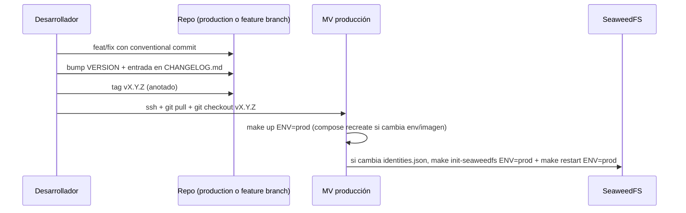

# Contexto del Repositorio Acervo

Documento de referencia completo del servicio. Está pensado para que cualquier persona (o LLM) que entre al repo entienda la intención del diseño, los puntos donde se han pisado callos y las invariantes que hay que respetar al modificar.

> Última reescritura mayor: 2026-05-13 (migración de MinIO → SeaweedFS, eliminación de modo standalone).

---

## 1. Propósito y rol en el ecosistema

**Acervo** es el servicio de almacenamiento de objetos del IIEG, montado sobre [SeaweedFS](https://github.com/seaweedfs/seaweedfs) (compatible con la API S3 de AWS). Es la capa de "blobs" para todos los frontends y backends del ecosistema institucional:

| Sistema | Bucket | Tipo | Lo que guarda |
|--------|--------|------|---------------|
| portal | `portal` | público (anonymous GetObject) | assets que sirve el portal público |
| mapalab | `mapalab` | público | datasets y exports geográficos |
| mariachi | `mariachi` | **privado** | assets staff-only del panel admin (logs descargables, exports internos) |
| sieej | `sieej` | privado | diccionarios y datos del SIEEJ |
| dataengine | `dataengine` | privado | pipelines y datos crudos del data engine |
| iieg | `iieg` | público | assets institucionales compartidos (logos, escudos, fuentes, iconos, avisos legales) |

`iieg` actúa como **bucket compartido**: cualquier frontend lo consume desde la misma ruta pública. Por eso conviene versionar paths (`/v1/logo.svg`, `/v2/logo.svg`) en lugar de sobrescribir — un cambio impacta a todos los frontends.

Cada bucket tiene su propio identity (`<bucket>-user`) en SeaweedFS con `actions` scoped al bucket correspondiente (`Admin:portal`, `Read:portal`, `Write:portal`, etc.). La cuenta `admin` se usa exclusivamente para administración (backup, restore, migración); los servicios consumen Acervo con sus credenciales scoped.

---

## 2. Modos de despliegue

El `Makefile` selecciona compose file y `.env` con una variable:

```
ENV = dev | prod          (default: dev)
```

### 2.1 `ENV=dev` — desarrollo local
- Archivo: `docker-compose.dev.yml`
- `.env`: `.env.development`
- Levanta solo SeaweedFS, expone `8333` (S3 API), `8888` (Filer) y `9091` (métricas) al host directamente.
- Sin gateway, sin SSL.

### 2.2 `ENV=prod` — producción detrás de gateway externo
- Archivo: `docker-compose.gateway.yml`
- `.env`: `.env.gateway`
- SeaweedFS se publica en una red externa `iieg-network` (declarada como `external: true`) y un gateway compartido (`gateway-hub`) enruta `/acervo/*` hacia este contenedor.
- Es el único modo de producción soportado (dominio `iieg.jalisco.gob.mx/acervo/`).

> **Selección de modo**:
> ```
> make up                # dev
> make up ENV=prod       # gateway (producción)
> ```

> **Histórico**: existió un modo `INFRA=standalone` con Nginx propio + UFW + cert autofirmado (versiones 1.0.0 – 1.21.2). Se retiró en 1.22.0 porque desde 1.18.x toda producción real corría en modo gateway.

---

## 3. Arquitectura

```mermaid
flowchart LR
    gw["gateway-hub<br/>(otro repo, otra red)"]
    iiegnet[("iieg-network<br/>(external)")]
    seaweed["acervo-seaweedfs<br/>S3 :8333 / metrics :9091"]
    init["acervo-init (profile 'init')<br/>alpine + jq"]
    prom["prometheus<br/>(huachicol)"]

    gw -- /acervo/* --> iiegnet --> seaweed
    init -. genera config/identities.json .-> seaweed
    prom -- scrape :9091/metrics --> seaweed
```

**Diferencias clave vs MinIO**:
- SeaweedFS no tiene consola embebida tipo "MinIO Browser". Admin se hace via S3 API (mc, rclone) o via `weed shell` desde dentro del contenedor.
- El endpoint de métricas Prometheus es **público en red interna** sin auth (puerto `9091`), separado del puerto de la S3 API.
- Las identidades no son "users + policies + anonymous separados". Son una lista única en `config/identities.json` con un identity por consumidor.
- `MINIO_SERVER_URL` y `MINIO_BROWSER_REDIRECT_URL` no aplican. SeaweedFS no requiere config de URL pública para que sigv4 funcione.

---

## 4. Componentes

### 4.1 SeaweedFS (`acervo-seaweedfs`)
- Imagen: `chrislusf/seaweedfs:${SEAWEEDFS_VERSION:-4.23}`. Latest stable a may-2026.
- Comando: `weed server -dir=/data -s3 -s3.config=/etc/seaweedfs/identities.json -s3.port=8333 -metricsPort=9091 -ip=acervo-seaweedfs`. All-in-one mode (master + volume + filer + s3 en un solo proceso).
- Volumen persistente: `seaweedfs_data` (Docker volume).
- Bind mount: `./config:/etc/seaweedfs:ro` — donde vive `identities.json` (generado por init, gitignored).
- Entrypoint custom: `scripts/seaweedfs-entrypoint.sh` aborta el arranque si `identities.json` no existe o está vacío (evita un deploy accidental sin auth, ver §5.2).
- Healthcheck: `wget --spider http://localhost:8333/status` cada 30s.
- Hardening: `no-new-privileges:true`, `cap_drop: ALL`.
- Puertos publicados al host (modo gateway): solo `${ACERVO_S3_PORT:-8333}:8333`. Las métricas se consumen por DNS interno desde la red `iieg-network`.

### 4.2 Init de identidades (`scripts/init-seaweedfs.sh`, perfil `init`)
- Imagen: `alpine:3.20`. Profile `init` para que no levante automáticamente con `up`.
- Hace `apk add --no-cache jq openssl` en runtime.
- Para cada bucket en `ACERVO_BUCKETS`:
  - Crea o preserva el identity `<bucket>-user` con `accessKey == name`, `secretKey` aleatorio de 32 chars.
  - Si el user ya existe en `identities.json`, se preserva su `secretKey` (no se rota a menos que se pase `ROTATE_FLAG=1`).
  - Asigna `actions: ["Admin:<bucket>", "Read:<bucket>", "Write:<bucket>", "List:<bucket>", "Tagging:<bucket>"]` (scope estricto al bucket).
- Crea el identity `admin` con las credenciales de `ACERVO_ADMIN_ACCESS_KEY/SECRET_KEY` y `actions: ["Admin", "Read", "Write", "List", "Tagging"]` (sin scope = todos los buckets).
- Si `ACERVO_PUBLIC_BUCKETS` tiene valor, crea el identity `anonymous` (sin credenciales) con `actions: ["Read:portal", "Read:mapalab", "Read:iieg"]` (o el subset definido).
- Flag `ROTATE_FLAG=1`: aunque el user exista, regenera password y la imprime. Combinable con `TARGET_BUCKET=portal` para rotar solo uno.
- Passwords se imprimen solo cuando se generan. Si se pierden, el único camino es rotación.
- Tras correr el init, **hay que reiniciar SeaweedFS** (`make restart ENV=prod`) para que cargue el `identities.json` actualizado. SeaweedFS lee el archivo al startup, no en caliente.

### 4.3 Migración one-shot desde MinIO (`scripts/migrate-from-minio.sh`)
- Script de migración única, se conserva en el repo para fines de auditoría aunque solo se corra una vez.
- Detecta el volumen Docker `acervo_minio_data` (sobrevivido del bump 1.21.x).
- Levanta un contenedor `pgsty/minio` efímero contra ese volumen, lo conecta a la red de SeaweedFS, corre `mc mirror` por bucket.
- Verifica conteo de objetos en ambos lados al final.
- Variables requeridas: `MIGRATE_MINIO_ACCESS_KEY/SECRET_KEY` (las viejas, root de MinIO). El admin de destino lo toma de `ACERVO_ADMIN_*`.
- **No es idempotente respecto a deltas concurrentes**: si MinIO sigue recibiendo escrituras durante la corrida, esos objetos pueden quedar fuera. Recomendado parar consumidores que escriben (`mariachi`, `dataengine`) antes de correr.

### 4.4 Backup (`scripts/backup.sh`)
- Frecuencia: mensual (cron) — ver §6.
- Para cada bucket en `ACERVO_BUCKETS`:
  - Detecta la red de `acervo-seaweedfs` con `docker inspect`.
  - Corre un contenedor temporal `pgsty/mc:RELEASE.2026-04-17T00-00-00Z` en esa red (mc sigue funcionando contra SeaweedFS porque ambos hablan S3), monta `${MONTHLY_DIR}` y hace `mc mirror acervo/<bucket> /backup/<bucket>`.
- Comprime todo el directorio `monthly/<DATE>/` en `monthly/backup-<DATE>.tar.gz`.
- **Limpieza del directorio temporal**: usa un contenedor `alpine find -delete` (en lugar de `rm -rf` desde host) — el contenido pertenece al usuario root del contenedor de `mc`, no al usuario host.
- Rotación:
  - tarballs > `BACKUP_RETENTION_MONTHS * 30` días → borrados.
  - logs > 90 días → borrados.
- Logs en `${BACKUP_DIR}/logs/backup-<TIMESTAMP>.log`.

### 4.5 Restore (`scripts/restore.sh`)
- Busca tarballs en `${BACKUP_DIR}/monthly` y en `./restore/` (directorio local, útil para restaurar de un dump recibido por correo / pendrive).
- Sin args: lista interactiva de tarballs disponibles.
- Con args: `bash scripts/restore.sh <YYYY-MM-DD> [<bucket>]`.
- **Detección dinámica de contenedor SeaweedFS**: prueba `acervo-seaweedfs` primero, después `acervo-seaweedfs-dev`. Toma la red de `docker inspect`.
- Extrae el tar a un `mktemp -d`, hace `mc mirror /restore/<bucket> acervo/<bucket> --overwrite` por bucket.
- Si el bucket no está en el tar, lo saltea con un `WARNING`.

---

## 5. Decisiones de diseño que duelen al modificar

Casi todas vienen de un `fix` específico en el changelog. Si las tocas, valida con cuidado.

### 5.1 SeaweedFS arranca abierto si no hay `-s3.config`
Por default SeaweedFS expone la S3 API sin auth. La protección está en `scripts/seaweedfs-entrypoint.sh`, que verifica que `/etc/seaweedfs/identities.json` exista y no esté vacío **antes** de exec a `weed server`. Si el archivo no existe, el contenedor falla rápido con un mensaje claro. **No remuevas el entrypoint custom sin un reemplazo equivalente** (e.g. un build con la config baked-in).

### 5.2 Las credenciales de admin no se generan en el init
A diferencia de los `<bucket>-user` (passwords aleatorias generadas por el init), las credenciales del identity `admin` vienen de `ACERVO_ADMIN_ACCESS_KEY/SECRET_KEY` del `.env.gateway`. Esto es deliberado: el admin es la cuenta de operación humana, no rotada automáticamente. Para rotarla, edita el `.env`, corre `make init-seaweedfs ENV=prod` y reinicia.

### 5.3 El init NO se conecta al servidor SeaweedFS
A diferencia del viejo `init-buckets.sh` (que hablaba con MinIO via `mc`), `init-seaweedfs.sh` solo escribe `config/identities.json` en disco. SeaweedFS lee el archivo en su próximo arranque. Por eso el flujo correcto es: `make init-seaweedfs ENV=prod` → `make restart ENV=prod`.

### 5.4 Los buckets se crean implícitamente al primer `PUT` o `mc mb`
SeaweedFS no requiere "crear" un bucket de antemano para que un identity con `Write:<bucket>` lo pueda usar. El primer `PUT` materializa el bucket. El script de migración corre `mc mb new/<bucket> --ignore-existing` por buena medida.

### 5.5 Las métricas Prometheus están sin auth en red interna
SeaweedFS expone `/metrics` en `-metricsPort=9091` sin token. La protección es de red: solo contenedores en `iieg-network` pueden llegar al puerto. El scrape de huachicol pasa de `http://acervo-minio:9000/minio/v2/metrics/...` con bearer a `http://acervo-seaweedfs:9091/metrics` sin auth.

### 5.6 `docker inspect` para detectar la red de SeaweedFS
Tanto `backup.sh` como `restore.sh` derivan la red en runtime (`docker inspect acervo-seaweedfs -f '{{range ...}}'`). Esto sobrevive renombres y cambios de proyecto compose. No hardcodear el nombre de la red.

### 5.7 El cliente `mc` se mantiene como herramienta de admin/backup
Aunque migramos del **servidor** MinIO a SeaweedFS, `mc` (el CLI de MinIO) sigue siendo nuestra herramienta para `mirror`, `ls`, `mb`, etc. porque habla S3 nativo y maneja sigv4 bien. La imagen pineada es `pgsty/mc:RELEASE.2026-04-17T00-00-00Z`. Si `pgsty/mc` se vuelve inestable, se puede sustituir por `rclone/rclone` (sintaxis distinta pero equivalente).

### 5.8 Eliminación del modo standalone como decisión consciente
El modo standalone (Nginx propio + UFW + cert autofirmado) era válido cuando producción servía la S3 API en un subdominio dedicado (`s3.jalisco.gob.mx`). Desde 1.18.x todo va por `iieg.jalisco.gob.mx/acervo/*` via gateway. Mantener standalone como modo dormido tenía costo: dos compose files, certs autofirmados, scripts de firewall, entrypoint dinámico de Nginx con dos plantillas. Borrarlo libera ~60% del código del repo y enfoca la atención.

---

## 6. Cron y operación

| Comando | Efecto |
|--------|--------|
| `make cron-install ENV=prod` | Instala `0 3 1 * * /bin/bash <repo>/scripts/backup.sh` con `ENV_FILE=.env.gateway`. Sobrescribe el crontab del usuario actual. |
| `make cron-remove` | `crontab -r`. **Cuidado**: borra TODO el crontab del usuario, no solo la entrada de acervo. |
| `make backup ENV=prod` | Respaldo manual inmediato. |
| `make backup-list ENV=prod` | Lista los tarballs mensuales. |
| `make restore DATE=YYYY-MM-DD [BUCKET=nombre] ENV=prod` | Restaura todos los buckets o uno específico. |

> **Política de retención**: `BACKUP_RETENTION_MONTHS` (default 2) → los tarballs mayores a `MONTHS*30` días se borran al final de cada corrida. Logs en `${BACKUP_DIR}/logs` se conservan 90 días.

---

## 7. Variables de entorno (resumen)

| Variable | Prod (gateway) | Dev | Función |
|---------|:--:|:--:|---------|
| `COMPOSE_PROJECT_NAME` | ✓ | ✓ | Aísla los recursos compose. |
| `SEAWEEDFS_VERSION` | ✓ | ✓ | Tag de imagen `chrislusf/seaweedfs:<tag>`. Default `4.23`. |
| `ACERVO_S3_PORT` | ✓ | ✓ | Puerto que publica SeaweedFS al host. Default `8333`. |
| `ACERVO_FILER_PORT` | — | ✓ | Puerto del Filer (solo dev). |
| `ACERVO_METRICS_PORT` | — | ✓ | Puerto Prometheus (solo dev). |
| `ACERVO_ADMIN_ACCESS_KEY` / `ACERVO_ADMIN_SECRET_KEY` | ✓ | ✓ | Credenciales del identity `admin`. |
| `ACERVO_BUCKETS` | ✓ | ✓ | Lista (space-separated, entre comillas) de buckets canónicos. |
| `ACERVO_PUBLIC_BUCKETS` | ✓ | ✓ | Subconjunto que recibe anonymous GetObject. Default `portal mapalab iieg`. |
| `BACKUP_DIR` | ✓ | — | Directorio destino de backups (default `/backups/acervo`). |
| `BACKUP_RETENTION_MONTHS` | ✓ | — | Meses a conservar (default 2). |
| `MIGRATE_MINIO_ACCESS_KEY` / `MIGRATE_MINIO_SECRET_KEY` | (one-shot) | — | Solo durante migración. Se borran después. |
| `MIGRATE_MINIO_VOLUME` | (one-shot) | — | Nombre del volumen Docker viejo (default `acervo_minio_data`). |

Convención clave: `ACERVO_BUCKETS` y `ACERVO_PUBLIC_BUCKETS` deben ir **entre comillas** en los `.env*` (commit `5be8721`), porque docker compose no parsea espacios en valores sin comillas.

---

## 8. Versionado, ramas y deudas

### Versionado
- `VERSION` es la fuente de verdad. Cada `feat` → minor, `fix`/`perf`/`refactor`/`chore`/`docs` → patch.
- Conventional commits (regla de proyecto IIEG).
- `1.0.0` marcó la salida a producción inicial; hoy va por `1.22.0` (migración a SeaweedFS).

### Ramas
- `main` — tracking upstream.
- `develop` — integración (en la práctica está atrás de production; ver "Deudas conocidas").
- `production` — lo que está desplegado en la MV. Es la rama por defecto en este worktree.

### Tags importantes
- `v1.21.2` — último estado pre-migración a SeaweedFS. Punto de rollback canónico si la migración falla irreversiblemente.

### Deudas conocidas
- **`chrislusf/seaweedfs:4.23` solo en Docker Hub**. Mismo riesgo que se tenía con `pgsty/minio`: si Docker Hub borra la imagen o cambia el namespace, el siguiente `make up` rompe. Pendiente: mirror a Artifact Registry de GCP.
- **`make cron-remove` borra todo el crontab del usuario**, no solo la entrada de acervo. Si el usuario tiene otros crons, se pierden.
- **Backup mensual sin verificación de integridad post-tar**. No se hace un `tar -tzf` de smoke test. Si el disco falla a mitad del tar, el archivo queda corrupto y no nos enteramos hasta intentar un restore.
- **Sin offsite backup**. Todo vive en `BACKUP_DIR` local de la VM. Pérdida de la VM = pérdida de todos los respaldos.
- **`.env.gateway` con credenciales reales está en el árbol de trabajo local**. El `.gitignore` lo cubre (`*.env*` + whitelist solo de `.example`), pero hay que tener cuidado al copiar archivos o hacer dumps.
- **`develop` está 18+ commits atrás de `production`**. Históricamente se ha mergeado directo a production. No es un problema funcional, pero implica que `develop` no refleja la verdad operativa.
- **Endpoint `/ontoy` retirado**. Hasta 1.21.2 lo servía el Nginx interno de standalone. En modo gateway nunca llegó a haber una versión funcionando. Si monitoreo lo necesita, agregar un sidecar `nginx:alpine` que sirva `version.json` en un puerto interno + ruta en gateway.
- **`mc` (cliente MinIO) sigue como dependencia para backup/restore**. Pragmático pero acopla. Alternativa: migrar a `rclone` que también es Apache 2.0 y no depende del ecosistema MinIO.

---

## 9. Flujo de cambio típico



---

## 10. Cosas que NO hay en este repo (pero hay que saber)

- **El gateway externo** (`gateway-hub`) vive en otro repo. Acervo solo expone su contenedor en la red `iieg-network`; el routing `/acervo/*` lo hace el gateway.
- **Los clientes** (portal, mapalab, mariachi, sieej, dataengine, iieg, huachicol) viven cada uno en su repo y consumen acervo usando las credenciales `<bucket>-user` que entrega `init-seaweedfs.sh`.
- **El monitoreo** (Prometheus/Grafana). Tras 1.22.0 el scrape es directo a `http://acervo-seaweedfs:9091/metrics` sin auth en `iieg-network`. El repo que consume las métricas es `huachicol`.
- **El proceso de rotación de credenciales** se hace con `make rotate-seaweedfs ENV=prod [BUCKET=...]`. Las nuevas passwords se imprimen una vez; pasarlas al `.env.production` de cada cliente (variables `ACERVO_<REF>_SECRET_KEY`) es trabajo manual.
- **Cómo SeaweedFS internamente almacena los blobs**: usa el formato propio de "needles" en volumes binarios bajo `/data`. No son archivos planos. Para portabilidad, el camino canónico sigue siendo `mc mirror` a otra cosa S3-compatible.
