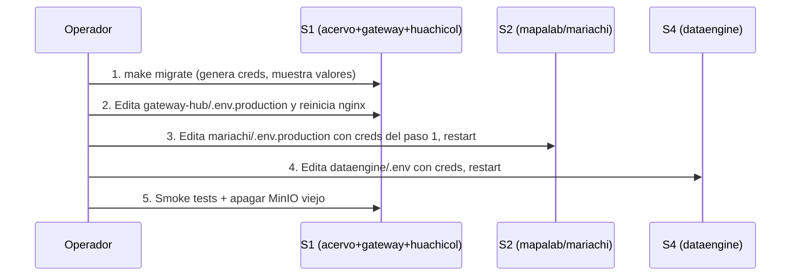

# Runbook — Migración MinIO → SeaweedFS (1.22.0)

Procedimiento operativo para administración (4 VMs separadas). En GCP (todo en un VM), `make migrate` lo hace automático y este runbook es referencia secundaria.

> **Pre-requisito**: tag `v1.21.2` ya pusheado a GitHub como punto de rollback. Si no existe, créalo antes de continuar.

---

## Topología y dónde corre cada cosa

| VM | Servicios | Repos |
|----|-----------|-------|
| **S1** | Gateway + Huachicol + Acervo | `/home/egar/IIEG/acervo`, `/home/egar/IIEG/gateway-hub`, `/home/egar/IIEG/huachicol` |
| **S2** | MapaLab (+ Mariachi*) | `/home/egar/IIEG/mapalab`, `/home/egar/IIEG/mariachi`* |
| **S3** | GeoServer | `/home/egar/IIEG/geoserver` (no relevante para esta migración) |
| **S4** | DataEngine | `/home/egar/IIEG/dataengine` |

\* Verifica con `docker ps` en qué VM corre `mariachi-api` antes de empezar — la propagación de credenciales tiene que pegarle ahí.

---

## Resumen del flujo



---

## Paso 1 — En S1: correr la migración

```bash
ssh egar@s1.iieg.example
cd /home/egar/IIEG/acervo
git fetch
git checkout v1.22.0
make setup                 # crea .env si no existe (luego editar con creds reales)
```

Edita `.env` con los valores reales de:
- `ACERVO_ADMIN_ACCESS_KEY` / `ACERVO_ADMIN_SECRET_KEY` (admin nuevo; genera con `openssl rand -base64 24`)
- `MIGRATE_MINIO_ACCESS_KEY` / `MIGRATE_MINIO_SECRET_KEY` (root viejo del MinIO actual — están en el `.env.gateway` anterior)
- `MIGRATE_MINIO_VOLUME=acervo_minio_data` (default; ajusta si tu volumen tiene otro nombre)

Luego:

```bash
make migrate
```

El script:
1. Detecta el modo (admin porque los repos `mariachi`, `dataengine` no están en este VM).
2. Hace `make backup` mientras MinIO sigue vivo → tar.gz en `/backups/acervo/monthly/`.
3. Corre `make init-seaweedfs` → genera `config/identities.json` con passwords aleatorias.
4. Levanta SeaweedFS y espera healthy.
5. Corre `migrate-from-minio.sh` → `mc mirror` del volumen viejo al nuevo SeaweedFS, valida conteos.
6. Lee `config/identities.json` y **imprime las nuevas credenciales en stdout**.

**Acción: copia la salida de `make migrate` a un lugar seguro.** Se ve así:

```
  Credenciales nuevas:
    ACERVO_PORTAL_ACCESS_KEY=portal-user
    ACERVO_PORTAL_SECRET_KEY=<32 chars random>
    ACERVO_MAPALAB_ACCESS_KEY=mapalab-user
    ACERVO_MAPALAB_SECRET_KEY=<32 chars random>
    ACERVO_MARIACHI_ACCESS_KEY=mariachi-user
    ACERVO_MARIACHI_SECRET_KEY=<32 chars random>
    ACERVO_SIEEJ_ACCESS_KEY=sieej-user
    ACERVO_SIEEJ_SECRET_KEY=<32 chars random>
    ACERVO_DATAENGINE_ACCESS_KEY=dataengine-user
    ACERVO_DATAENGINE_SECRET_KEY=<32 chars random>
    ACERVO_IIEG_ACCESS_KEY=iieg-user
    ACERVO_IIEG_SECRET_KEY=<32 chars random>
    ACERVO_ENDPOINT=acervo-seaweedfs:8333
    ACERVO_PUBLIC_ENDPOINT=/acervo
```

---

## Paso 2 — En S1: gateway-hub + huachicol

### 2.1 Gateway-hub

```bash
cd /home/egar/IIEG/gateway-hub
sed -i 's|ACERVO_HOST=acervo-minio:9000|ACERVO_HOST=acervo-seaweedfs:8333|' .env.production
# Si tienes ACERVO_CONSOLE_HOST=, comentalo (ya no aplica)
docker compose up -d nginx   # reload graceful, sin downtime real
```

Verifica:
```bash
curl -I https://iieg.jalisco.gob.mx/acervo/iieg/v1/logo.svg   # debe ser 200 o 404, NO 502
```

### 2.2 Huachicol (Prometheus scrape de SeaweedFS)

`make migrate` ya actualizó `/home/egar/IIEG/huachicol/.env` (el repo vive en S1 y el script lo detecta). Verifica:

```bash
cd /home/egar/IIEG/huachicol
grep ACERVO_METRICS_TARGET .env   # debe decir acervo-seaweedfs:9091
```

Edita `prometheus/prometheus.yml` para apuntar el job de acervo a la nueva ruta (sin auth):

```yaml
- job_name: 'acervo-seaweedfs'
  static_configs:
    - targets: ['acervo-seaweedfs:9091']
  # Quitar el bloque bearer_token: ${ACERVO_MINIO_TOKEN} y las labels MinIO-especificas
```

Recarga:
```bash
docker compose up -d --force-recreate prometheus
```

---

## Paso 3 — En S2: mariachi (los 5 buckets que consume)

```bash
ssh egar@s2.iieg.example
cd /home/egar/IIEG/mariachi
```

Edita `.env.production`. Tienes que cambiar:

```
ACERVO_ENDPOINT=acervo-seaweedfs:8333   # antes: acervo-minio:9000
ACERVO_PORTAL_SECRET_KEY=<el valor del paso 1>
ACERVO_MAPALAB_SECRET_KEY=<el valor del paso 1>
ACERVO_MARIACHI_SECRET_KEY=<el valor del paso 1>
ACERVO_SIEEJ_SECRET_KEY=<el valor del paso 1>
ACERVO_IIEG_SECRET_KEY=<el valor del paso 1>
```

(Los `ACCESS_KEY` no cambian: siguen siendo `<bucket>-user`.)

Reinicia:
```bash
docker compose up -d --force-recreate
```

Verifica logs:
```bash
docker compose logs -f api | grep -i acervo   # buscar errores 403/SignatureDoesNotMatch
```

> **Si Mariachi vive en otro VM**, repite estos pasos en ese VM en su lugar. Confirma con `docker ps` en cada uno.

---

## Paso 4 — En S4: dataengine

```bash
ssh egar@s4.iieg.example
cd /home/egar/IIEG/dataengine
```

Edita `.env`:

```
AO_ENDPOINT=http://acervo-seaweedfs:8333
AO_BUCKET=dataengine
AO_ACCESS_KEY=dataengine-user
AO_SECRET_KEY=<el valor del paso 1>
```

Reinicia el servicio que escribe respaldos:
```bash
docker compose up -d --force-recreate
```

---

## Paso 5 — De vuelta en S1: smoke tests

```bash
ssh egar@s1.iieg.example

# 1. Anonymous read (publico)
curl -I https://iieg.jalisco.gob.mx/acervo/iieg/v1/logo.svg
# Esperado: 200 si el objeto existe, 404 si no. NUNCA 502.

# 2. Write desde mariachi (revisar logs por errores S3)
docker logs $(docker ps -q --filter name=mariachi-api) --tail 50 | grep -iE 'acervo|s3|403'

# 3. Backup nuevo desde SeaweedFS funcional
cd /home/egar/IIEG/acervo
make backup
make backup-list
```

---

## Paso 6 — Apagar MinIO viejo (cuando smoke tests pasen)

**No te apresures.** Espera al menos unas horas de operación estable antes de apagar.

```bash
# Apagar el contenedor (volumen acervo_minio_data se queda como salvataje)
docker stop acervo-minio
docker rm acervo-minio

# Despues de 24-72h estables, liberar el volumen
docker volume rm acervo_minio_data

# Borrar imagenes MinIO ya no usadas
docker image rm pgsty/minio:RELEASE.2026-04-17T00-00-00Z
docker image rm pgsty/mc:RELEASE.2026-04-17T00-00-00Z
```

---

## Rollback

Si algo falla **antes** del Paso 2.1 (flip del gateway): nada se rompió. SeaweedFS solo absorbió una copia. `docker stop acervo-seaweedfs` y MinIO sigue activo en su volumen.

Si rompe **después**:

```bash
# En S1:
cd /home/egar/IIEG/acervo
git checkout v1.21.2
mv .env .env.new          # preserva el .env nuevo por si quieres
mv .env.gateway.backup .env.gateway   # restaura el viejo si lo tienes
make up                  # arranca MinIO de nuevo desde acervo_minio_data (aun existe)

cd /home/egar/IIEG/gateway-hub
sed -i 's|ACERVO_HOST=acervo-seaweedfs:8333|ACERVO_HOST=acervo-minio:9000|' .env.production
docker compose up -d nginx

# En S2 y S4: restaurar los .env.production / .env desde git stash o backup
git stash pop  # si guardaste antes
docker compose up -d --force-recreate
```

Si el volumen `acervo_minio_data` ya se borró:

```bash
cd /home/egar/IIEG/acervo
git checkout v1.21.2
make restore DATE=YYYY-MM-DD   # del tar.gz del Paso 1.2
```

---

## Checklist condensado

- [ ] Tag `v1.21.2` existe en GitHub.
- [ ] **S1**: `make migrate` corre limpio. Creds nuevas guardadas.
- [ ] **S1**: `gateway-hub/.env.production` apunta a `acervo-seaweedfs:8333`. `make up -d nginx` aplicado.
- [ ] **S1**: `huachicol/.env` actualizado. Prometheus reiniciado.
- [ ] **S2**: `mariachi/.env.production` con nuevas creds. `docker compose up -d --force-recreate` corrido.
- [ ] **S4**: `dataengine/.env` con nuevas creds. Restart.
- [ ] Smoke tests: anonymous GET responde, mariachi/dataengine sin errores 403 en logs.
- [ ] (24-72h después) MinIO viejo apagado, volumen liberado.

---

## En GCP (1 VM con todos los repos)

Es trivial — `make migrate` corre automáticamente la propagación porque detecta que `mariachi`, `huachicol`, etc. existen en `/home/egar/IIEG/`. Solo necesitas:

```bash
cd /home/egar/IIEG/acervo
git fetch && git checkout v1.22.0
make setup                # edita .env como en S1 Paso 1
make migrate              # detecta MODE=gcp, hace todo
```

El script termina mostrando los comandos finales para reiniciar consumidores (también copy-paste, pero un solo VM).
